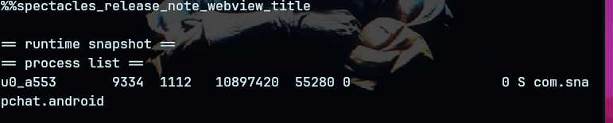

<p align="center">
  
</p>

# APDIF

**Android Package & Device Inspection Framework**

> **Motto:** **APDIF — inspect whats _under_**

APDIF is a shell-first Android security testing CLI for inspecting packages, triaging apps, and generating concise case reports.

It is built for practical Android app security testing, rooted-device workflows, package inspection, and local evidence collection.

---

## What it does

APDIF helps you quickly inspect Android targets and collect useful security context:

- package and APK triage
- installed app inspection
- permission and manifest review
- deep link, receiver, service, and provider enumeration
- WebView, files, preferences, database, and storage review
- device doctor checks
- Markdown and JSON report generation

---

## Requirements

APDIF currently works best with:

- a **rooted Android device**
- `adb`
- shell access
- Android platform tools
- Linux host environment

Rooted workflows are the main supported path for now. Non-root support can be expanded later.

---

## Install

Clone the repository:

```bash
git clone https://github.com/usercopy-fault/fieldglass.git
cd fieldglass
```

Make the launcher executable:

```bash
chmod +x bin/apdif 2>/dev/null || chmod +x apdif
```

Optional: add APDIF to your PATH:

```bash
mkdir -p ~/.local/bin
ln -sf "$PWD/bin/apdif" ~/.local/bin/apdif 2>/dev/null || ln -sf "$PWD/apdif" ~/.local/bin/apdif
```

Verify:

```bash
apdif --help
```

---

## Commands

Show help:

```bash
apdif --help
```

List command patterns:

```bash
apdif cheat list
```

Run device checks:

```bash
apdif device doctor
apdif device doctor --serial SERIAL
```

Run triage against an installed package:

```bash
apdif triage run --pkg PKG --case NAME --profile PROFILE
apdif triage run --pkg PKG --case NAME --profile PROFILE --json
apdif triage run --pkg PKG --case NAME --profile PROFILE --serial SERIAL
```

Run triage against an APK file:

```bash
apdif triage run --apk FILE --case NAME --profile PROFILE
```

Build a final report:

```bash
apdif report build --case NAME --pkg PKG --profile PROFILE
apdif report build --case NAME --pkg PKG --profile PROFILE --format md
apdif report build --case NAME --pkg PKG --profile PROFILE --format json
```

---

## Screenshots

### Command grammar

<p align="center">
  
</p>

### Runtime snapshot

<p align="center">
  
</p>

### Triage output

<p align="center">
  
</p>

---

## Example workflow

```bash
apdif device doctor
apdif triage run --pkg com.example.app --case example_case --profile default
apdif report build --case example_case --pkg com.example.app --profile default --format md
```

---

## Status

APDIF is under active development.

Current focus:

- rooted Android workflows
- cleaner package triage
- better report generation
- stable command grammar
- stronger evidence output
