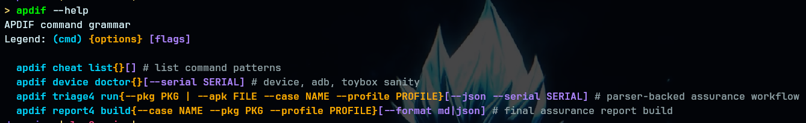
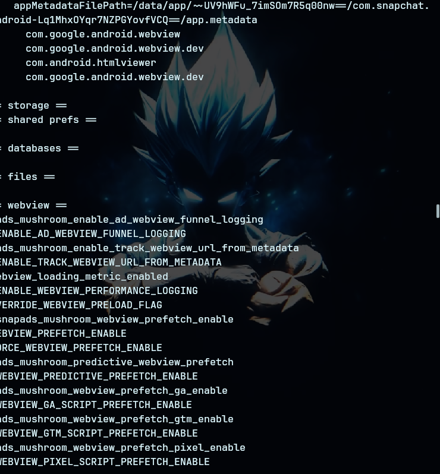

<p align="center">
  
</p>

# APDIF

**Android Package & Device Inspection Framework**

APDIF is a command-line inspection framework for Android package triage, rooted-device review, WebView artifact discovery, and report generation.

> **Motto:** **APDIF — inspect whats _under_**

---

## What APDIF does

APDIF helps Android security researchers collect repeatable evidence from a target package or APK.

It is built to:

- inspect installed Android packages
- triage APK files or package names
- collect runtime, storage, permission, and WebView indicators
- organize case output by package/profile
- generate Markdown or JSON reports

APDIF is currently optimized for **rooted Android testing**.

---

## Requirements

Recommended setup:

- Linux workstation
- `adb`
- rooted Android device
- shell access to the device
- Android toybox/core shell utilities
- optional: `jq`, `sqlite3`, `aapt`, `apktool`, `jadx`

Check your environment:

```bash
apdif device doctor
```

---

## Install

Clone the repository:

```bash
git clone https://github.com/YOUR_USERNAME/apdif.git
cd apdif
```

Make the CLI executable:

```bash
chmod +x apdif
```

Install it into your local PATH:

```bash
mkdir -p ~/.local/bin
ln -sf "$PWD/apdif" ~/.local/bin/apdif
```

Verify:

```bash
apdif --help
```

---

## Commands

### Help

```bash
apdif --help
```

### Cheat patterns

```bash
apdif cheat list
```

### Device sanity checks

```bash
apdif device doctor
apdif device doctor --serial SERIAL
```

### Triage workflow

```bash
apdif triage run --pkg PKG --case NAME --profile PROFILE
apdif triage run --apk FILE --case NAME --profile PROFILE
apdif triage run --pkg PKG --case NAME --profile PROFILE --json
apdif triage run --pkg PKG --case NAME --profile PROFILE --serial SERIAL
```

### Report generation

```bash
apdif report build --case NAME --pkg PKG --profile PROFILE
apdif report build --case NAME --pkg PKG --profile PROFILE --format md
apdif report build --case NAME --pkg PKG --profile PROFILE --format json
```

---

## Example workflow

```bash
apdif device doctor
apdif triage run --pkg com.example.app --case example_case --profile default
apdif report build --case example_case --pkg com.example.app --profile default --format md
```

---

## Screenshots

### Command grammar

<p align="center">
  
</p>

### Runtime snapshot

<p align="center">
  
</p>

### Inspection output

<p align="center">
  
</p>

---

## Output focus

APDIF is designed to surface evidence around:

- package metadata
- runtime state
- process information
- storage paths
- shared preferences
- databases
- local files
- WebView flags and metadata
- reportable security indicators

---

## Status

APDIF is under active development. Current priority is improving rooted-device triage, parser-backed assurance workflows, and clean report output.

---

## License

Add your project license here.
